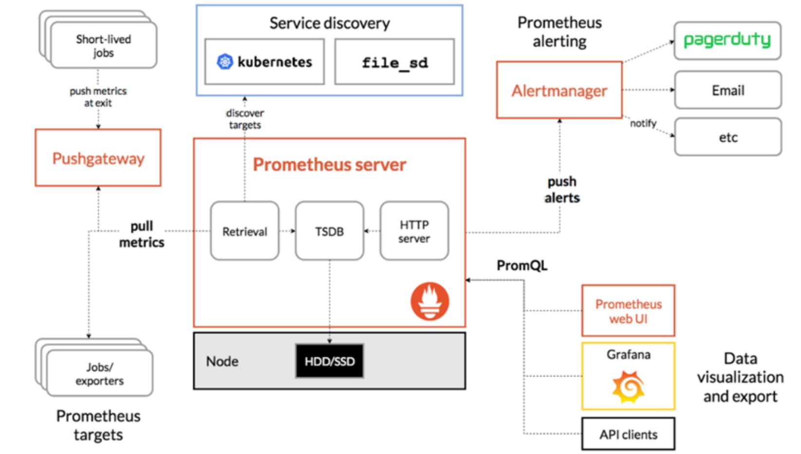

# 配置

## role.yaml

给prometheus创建一个role，让role有可以访问metrec资源所有权限，并且把这个role绑定到serviceaccount default上，稍候启动的prometheus服务会使用这个serviceaccount。

## namespace.yaml
给prometheus相关的所有资源定义一个namesapce

## config-map.yaml

prometheus的配置文件，存储到ConfigMap对象里面，promethues启动之后读取这个ConfigMap对自身进行配制。


## prometheus.yaml

prometheus的deployment，本例部署的是镜像是prom/prometheus


# 架构说明



本例子中的prometheus是以deployment形式部署的，其中包括:一个时序数据库，一个web服务器可以执行ProQL，以及抓取数据的retrieval(scraper)。

retrieval以pull的方式拉取数据，即一定时间间隔访问在配置文件中配置好的endpoint的固定路径拉取metrics数据。

## Prometheus 收集数据的基本格式
Prometheus 采集和存储的数据本质上是一组时间序列（Time Series），每一条时间序列都有：

- 一个metric 名字（比如 http_requests_total）

- 一组label（标签）（比如 {method="GET", handler="/api"}）

- 一组时间戳和值

一个具体的数据点的结构示例：

```
# HELP http_requests_total The total number of HTTP requests.
# TYPE http_requests_total counter
http_requests_total{method="GET"} 1027 1624624652000
http_requests_total{method="POST"} 24 1624624652000
```
- 1027为数值
- 1624624652000为时间戳
- 前面注释部分的`TYPE http_requests_total counter`标注了metric的类型

## Prometheus 的**基本 metric 类型**有四种（严格来说五种，但 untyped 很少见）：

1. **Counter**
2. **Gauge**
3. **Histogram**
4. **Summary**
5. （Untyped）

下面详细解释每种类型的用途、特点和典型用法：

---

### 1. **Counter**

#### **定义**

* **Counter** 是一个只能递增（或在重启时归零）的累积型指标。
* 常用于记录某个事件累计发生的次数。

#### **特征**

* 只能加，不能减。
* 例如：请求数、任务完成数、错误数等。

#### **Prometheus 展示**

```text
# TYPE http_requests_total counter
http_requests_total{method="GET"} 1027
```

#### **常见用法**

* 统计 API 请求次数
* 记录错误发生总数
* 统计任务完成总数

---

### 2. **Gauge**

#### **定义**

* **Gauge** 是一个可以上下浮动的数值型指标。

#### **特征**

* 可以加也可以减，随时可以任意设定为某个值。
* 适用于表示瞬时状态。

#### **Prometheus 展示**

```text
# TYPE memory_usage_bytes gauge
memory_usage_bytes 3145728
```

#### **常见用法**

* 内存用量
* 当前温度
* 当前连接数
* 进程中的 goroutine 数量

---

### 3. **Histogram**

#### **定义**

* **Histogram** 用于记录观测值（如请求耗时、响应大小等）的**分布**和**计数**。

##### **特征**

* Histogram 会将观测值按照配置的\*\*桶（buckets）\*\*统计每个区间有多少个观测值，并累计总数和总和。
* 适用于需要分析数值分布情况的场景。

#### **Prometheus 展示**

```text
# TYPE http_request_duration_seconds histogram
http_request_duration_seconds_bucket{le="0.1"} 24054
http_request_duration_seconds_bucket{le="0.2"} 33444
http_request_duration_seconds_bucket{le="0.5"} 100392
http_request_duration_seconds_bucket{le="1"} 129389
http_request_duration_seconds_bucket{le="+Inf"} 144320
http_request_duration_seconds_sum 53423
http_request_duration_seconds_count 144320
```

#### **常见用法**

* 请求延迟分布
* 事务处理时间分布
* 响应体大小分布

---

### 4. **Summary**

#### **定义**

* **Summary** 也是记录观测值的统计，但它会计算**分位数（quantile）**，比如 0.5 (中位数), 0.9, 0.99 等。

#### **特征**

* 直接在采集端计算分位数（通常是滑动窗口）。
* 记录 sum 和 count，可计算平均值。
* 与 Histogram 区别在于，Summary 直接输出分位数，而 Histogram 只给桶的数据，分位数需查询时用桶数据估算。

#### **Prometheus 展示**

```text
# TYPE http_request_duration_seconds summary
http_request_duration_seconds{quantile="0.5"} 0.05
http_request_duration_seconds{quantile="0.9"} 0.1
http_request_duration_seconds{quantile="0.99"} 0.2
http_request_duration_seconds_sum 53423
http_request_duration_seconds_count 144320
```

#### **常见用法**

* 精确测量特定分位数的延迟
* 需要每个实例都能单独算出分位数（比如 SLA 要求）

---

### 5. **Untyped**

#### **定义**

* 没有指定类型的 metric，通常 exporter 或 instrumented app 未加类型注释。
* Prometheus 默认处理为 untyped。

#### **特征**

* 在功能和 gauge 一样，可以任意变动。
* 一般不推荐使用，建议 always 指定类型。


### **类型对比表**

| 类型        | 递增/递减 | 主要用途     | 典型例子      | 能否分桶/分位数 |
| --------- | ----- | -------- | --------- | -------- |
| Counter   | 只能递增  | 事件累计     | 请求总数、错误总数 | 否        |
| Gauge     | 可增可减  | 状态/瞬时数值  | 内存用量、温度   | 否        |
| Histogram | 可增可减  | 观测值分布    | 请求延迟分布    | 分桶       |
| Summary   | 可增可减  | 观测值分位数统计 | 延迟分位数     | 分位数      |
| Untyped   | 可增可减  | 不推荐      | 不确定       | 否        |


# PromQL

## up

简单来说up语句是查询出当前所有job/exporter的状态。

在查询结果中，我们需要关注的是job标签，它的指示着该数据属于哪个exporter，up metric本身的value是0或者1，他表示改exporter是否是活动状态，即是否可以从该exporter取到metrics数据

往往一个下面会有行，每一个行其实代单个exporter，比如`kubernetes-nodes`的job就是在每个节点上有一个exporter，所以这个job的每一行对应一个node。


**注意：一个expoorter是可以导出多个metric数据的**、


## 列出所有metric

- curl http:[prometheus-endpoint]/api/v1/label/__name__/values
- 在UI上query语句右侧菜单中选择【explor metrics】

**在查询metric的时候，可以通过job标签来判别这个metric数据是从哪个exportor抓取的。**


